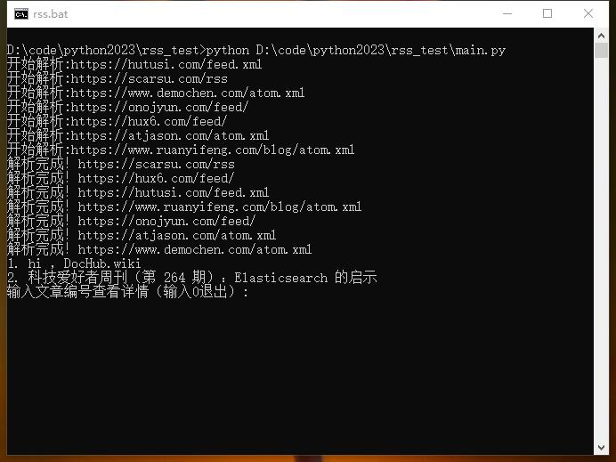

# Python Private RSS subscription

python结合feedparser模块编写的终端私人RSS订阅程序


## 截图




## 在本地运行

Clone 这个 project

```bash
  git clone https://link-to-project
```

前往项目目录

```bash
  cd my-project
```

安装依赖

```bash
  pip install feedparser
  pip install webbrowser
```

启动服务器

```bash
  python main.py
```


## 使用方法

编辑main.py中的rss订阅数组，修改成自己喜欢的RSS源即可。


## 作者

- [@octokatherine](https://www.github.com/octokatherine)

- [@我的博客](https://suiyan.cc)

