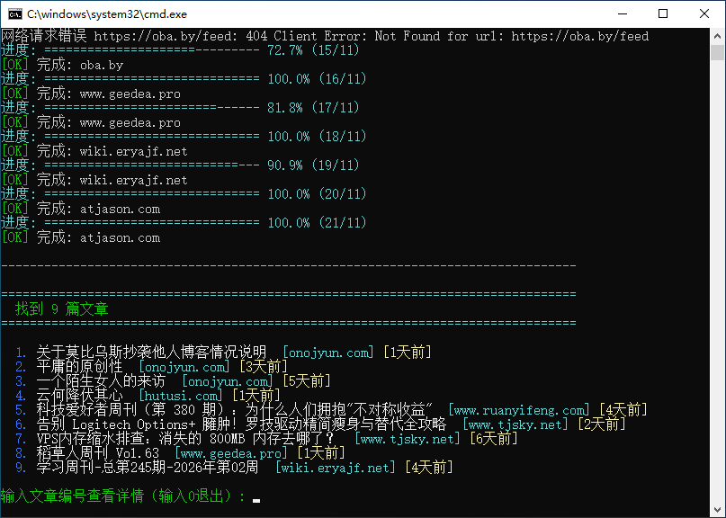

# Python Private RSS subscription

Python 结合 feedparser 模块编写的 RSS 订阅阅读器，支持终端和 GUI 两种界面。

## 功能特性

- 支持多个 RSS 源订阅
- 并发获取文章，提高效率
- 显示相对时间（如"3天前"、"2小时前"）
- 支持多种时间格式（RFC 2822、ISO 8601 等）
- 双界面支持：终端命令行和图形界面（GUI）
- 可配置获取文章的时间范围、并发数、超时时间

## 截图

### 终端界面



### GUI 界面


## 在本地运行

Clone 这个 project

```bash
  git clone https://github.com/bosichong/python_rss_subscription
```

前往项目目录

```bash
  cd python_rss_subscription
```

安装依赖

```bash
  pip install -r requirements.txt
```

### 启动程序

**终端版本：**

```bash
  python main.py
```

或双击 `rss.bat` 文件

**GUI 版本：**

```bash
  python gui.py
```

或双击 `gui.bat` 文件

## 使用方法

1. 编辑 `config.json` 文件中的 `rss_feeds` 数组，修改成自己喜欢的 RSS 源
2. 可以调整其他配置参数：
   - `weeks_limit`: 限制获取多少周内的文章（默认为1周）
   - `max_workers`: 最大并发线程数（默认为5）
   - `request_timeout`: 网络请求超时时间（秒，默认为30）

### GUI 界面操作

- 点击"刷新文章"按钮获取最新文章
- 点击"配置设置"调整参数
- 在左侧列表中添加/删除 RSS 源
- 双击文章可在浏览器中打开

### 终端界面操作

- 输入文章编号查看详情
- 输入 0 退出程序

## 项目结构

```
.
├── main.py           # 终端版本主程序
├── gui.py            # GUI 版本主程序
├── rss_core.py       # 核心 RSS 功能模块
├── config.json       # 配置文件
├── requirements.txt  # 依赖列表
├── rss.bat           # 终端版本启动脚本
├── gui.bat           # GUI 版本启动脚本
└── readme.md         # 说明文档
```

## 依赖

- feedparser >= 6.0.0
- requests >= 2.25.0
- colorama >= 0.4.4

## 作者

- [@octokatherine](https://github.com/bosichong/python_rss_subscription)
- [@我的博客](https://suiyan.cc)

